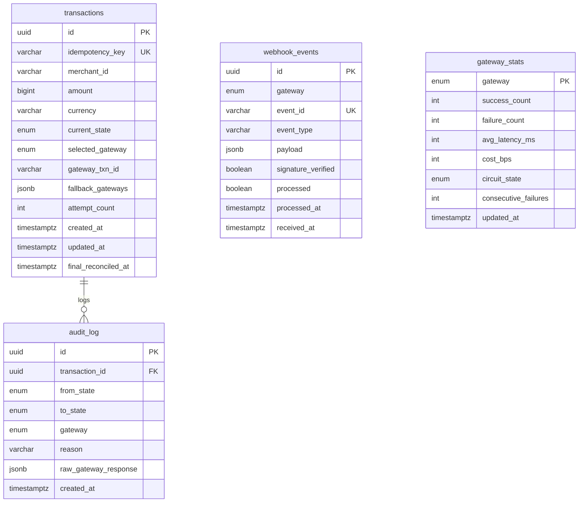

# Payment Orchestration Layer

A high-performance, resilient, and production-grade payment orchestration layer built with **NestJS**, **PostgreSQL**, and **Redis**. It provides intelligent payment routing, automatic failovers, circuit breaking, idempotency guarantees, and asynchronous webhook reconciliation across **Stripe**, **Razorpay**, **PayU**, and **UPI**.

---

## Key Features

1. **Robust Idempotency Guard**: Distributed request locking via Redis with standard 10-second TTL limits (and resilient local memory fallback), ensuring duplicate payment attempts are rejected or served instantly from cache.
2. **Dynamic Routing Engine**: Computes real-time gateway scores using success rates, cost basis points, latency (using Exponential Moving Average), and circuit states. Adjusts scoring weights dynamically based on the transaction value.
3. **Circuit Breaker Pattern**: Automatically trips a gateway's state to `OPEN` after 3 consecutive failures, routes traffic away for a 30-second cooldown, probes with a single transaction in `HALF_OPEN`, and self-heals back to `CLOSED` upon success.
4. **Resilient Failovers (SLA Races)**: Enforces a strict 1500ms timeout SLA. If a primary gateway times out or returns an error, the orchestration layer transparently failovers to fallback gateways sequentially mid-flight.
5. **Asynchronous Webhook Reconciliation**: Real-time webhook ingestion endpoints with signature hashing. Events are persisted to `webhook_events` under a unique index `(gateway, event_id)` for strict deduplication, and pushed to a reconciliation queue processed asynchronously by a background worker.
6. **Detailed Audit Trail**: A complete transaction state machine trail logged inside a Postgres transactional write using row-level write locks (`SELECT ... FOR UPDATE`) to eliminate concurrent updates and double-spend exploits.

---

## Database Architecture

The Postgres schema consists of four main tables, managed via TypeORM migrations:



---

## Getting Started

### 1. Installation
Clone the repository and install the NPM dependencies:
```bash
npm install
```

### 2. Environment Configuration
Copy `.env.example` to `.env` and configure your database, Redis hosts, and gateway credentials:
```bash
cp .env.example .env
```

### 3. Run Schema Migrations
Deploy the database schema and seed the baseline gateway configurations:
```bash
npm run migration:run
```

### 4. Run the Application
* **Development Server** (runs NestJS with hot-reload support):
  ```bash
  npm run start:dev
  ```
* **Production Build**:
  ```bash
  npm run build
  npm run start
  ```

---

## Running Tests

The test suite covers idempotency behavior, state machine transitions, circuit breaker recovery, and SLA race failover logic.

* **Execute All Tests**:
  ```bash
  npm run test
  ```
* **Execute Individual Suites**:
  ```bash
  # Idempotency checks
  npm run test:idempotency

  # State machine lifecycle checks
  npm run test:state-machine

  # Failover and Circuit Breaker logic
  npm run test:execution
  ```

---

## API Endpoints Reference

### Payments API

#### 1. Initiate a Payment
* **Endpoint**: `POST /payments`
* **Request Body**:
  ```json
  {
    "idempotencyKey": "unique-idempotency-key-uuid",
    "merchantId": "merchant-123",
    "amount": 5000,
    "currency": "INR"
  }
  ```
* **Response**: Returns the created transaction object.

#### 2. Get Transaction Status
* **Endpoint**: `GET /payments/:id`
* **Response**: Returns the current status of the transaction.

#### 3. Get Audit Trail History
* **Endpoint**: `GET /payments/:id/history`
* **Response**: Returns the complete transition log of the transaction.

---

### Monitoring & Webhooks API

#### 1. Get Gateway Statistics
* **Endpoint**: `GET /gateways/stats`
* **Response**: Returns active health logs, success metrics, and circuit states for all providers.

#### 2. Inbound Webhook Ingress URLs
Webhook notifications from gateways should be directed to the following controllers:
* **Stripe**: `POST /webhooks/stripe`
* **Razorpay**: `POST /webhooks/razorpay`
* **PayU**: `POST /webhooks/payu`
* **UPI**: `POST /webhooks/upi`
